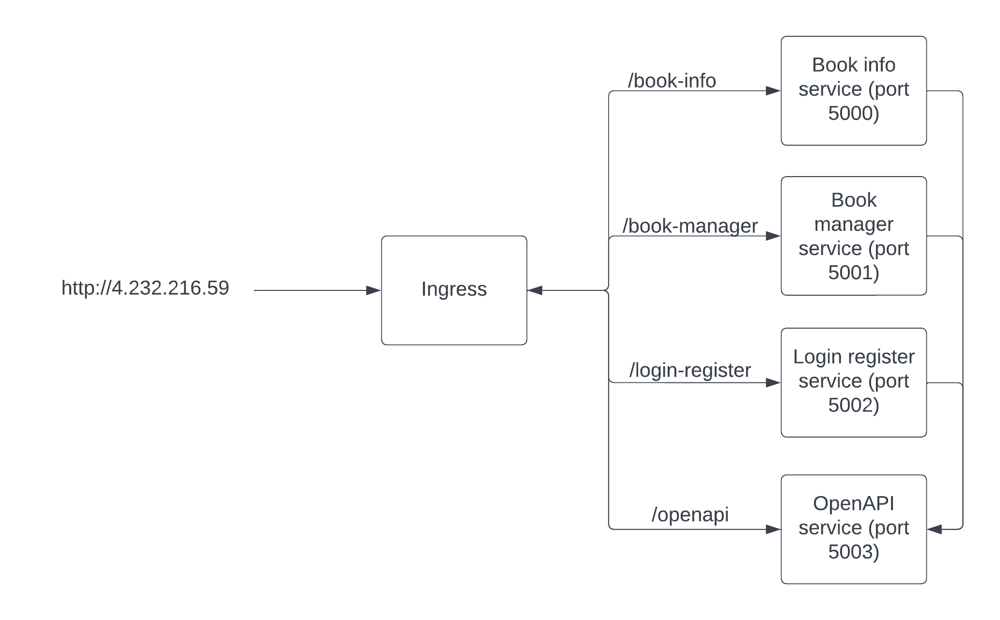

# Clound computing project - Book managment service
Authors:
* Andrej Susnik (as1767@student.uni-lj.si)
## Description

Simple book managment application, that simplifies managment of read books and recomends books according to the previously read ones. The system also fetches metadata from external sites for book descriptions, covers, date of publication, .... 

## IDE and frameworks

In my development environment, I rely on Visual Studio Code as my primary integrated development environment (IDE). Its versatility and extensive plugin support enhance my coding experience across various languages. For the backend, I've chosen Flask, a lightweight and efficient Python web framework, which allows me to build robust and scalable server-side applications. Flask's simplicity and flexibility are particularly advantageous for rapid development. On the frontend, I employ Svelte, a modern JavaScript framework that enables the creation of dynamic and responsive user interfaces with minimal overhead. Svelte's unique approach shifts the heavy lifting from the client to the build process, resulting in faster runtime performance. 

## Repositories

Github:
- https://github.com/AndrejSusnik/RSOProject

DockerHub:

- https://hub.docker.com/repository/docker/asusnik12354/book-info-retrieval-service/general
- https://hub.docker.com/repository/docker/asusnik12354/book-manager-service/general
- https://hub.docker.com/repository/docker/asusnik12354/login-register-service
- https://hub.docker.com/repository/docker/asusnik12354/openapi/general

## URL
The application can be accessed on url http://4.232.216.59/.

## Architecture
Application is composed of four microservices and an ingress. 

## Functionalities

OpenAPI service serves OpenAPI documentation user interface.

Book info service offeres two endpoints. The first one is /get_name_completion_list, this endpoint returns list of possible titles for a book given a partial title, it is used when user tries to add a book review. The second endpoint is /get_book_info this endpoint returns all available book info for a given title.

Book manager service offeres five endpoints.
- GET /book_reviews endpoint returns all book reviews for a given user
- GET /book_review endopint return book review
- POST /book_review endpoint adds a book review
- PUT /book_review endpoint modifies a book review
- DELETE /book_review endpoint deletes a book review 

Login register service has a lot of endpoints.

- POST /login verifyes users username and password 
- GET /users returns all users
- GET /user/{user_id} returns user information for a user with given user id
- POST /user/{user_id} adds a user
- PUT /user/{user_id} modifyes a user
- DELETE /user/{user_id} deletes a user

- GET /health/disable_db - disables database connection so that the service is restarted
- GET /health/invalidate_db_connection - switches database connection to mock database that throws an error
- GET /health/live - performes liveness check 
- GET /health/ready - performes readiness check

- GET /metrics - returns metrics about database and etcd server

- GET /etcd_demo/etcd - returns value of etcd key
- POST /etcd_demo/etcd - adds a key to etcd
- DELETE /etcd_demo/etcd - deletes a key from etcd
- GET /etcd_demo/config - returns value of config key

## Configuration
The application offers versatile configuration options, allowing users to tailor settings through multiple channels, including the convenient .env file, the structured config.yaml file, flexible environment variables, and seamless integration with the etcd server for dynamic and centralized configuration management.

## Healthcheck and metrics
We implemented healthcheks for database and etcd server. And we collect metrics about active database connections and reads and writes to the database since last restart.

## External API
We use external api https://rapidapi.com/roftcomp-laGmBwlWLm/api/hapi-books/. It is an api that provides information about books and their authors.

## Central logging system
For logging we use logit.io service. We are collecting diferent levels of loggs. For each incoming request we log the enterance point and all the errors that arise. We also log when database and etcd connections are established.

## Fault tolerance
For fault tolerance we prepared endpoint that switches database connection to mock database that throws an error. The service tries to retrieve information about a user and encounters an error, when it encounters an error the service will try to reconnect to the database. If it is still not successfull it will set helathcheck for database to down and kubernetes will restart the service.